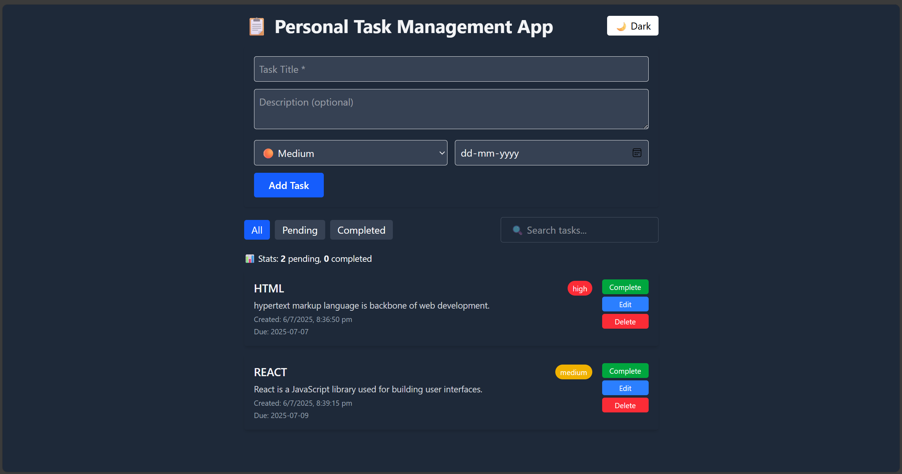

# 📋 Personal Task Manager App

A clean and feature-rich task manager app built using **React + Vite + Tailwind CSS** with full localStorage persistence.

---

## 🚀 Live Demo

🔗 Live Demo : https://lowcodelabs-task-manager-app.vercel.app/

---

## 🛠️ Tech Stack

- ⚛️ React 18+ with Hooks
- ⚡ Vite
- 🎨 Tailwind CSS
- 🧠 Context API for state management
- 💾 LocalStorage for data persistence

---

## 📦 Features

### ✅ Core Features

- Add, Edit, and Delete tasks
- Mark tasks as Completed or Pending
- Filter tasks by All / Pending / Completed
- Search tasks by title
- LocalStorage: persist tasks between sessions

### 🌟 Bonus Features

- Dark / Light mode toggle 🌙☀️
- Priority Levels (High, Medium, Low)
- Due Date with overdue warning
- Sort Dropdown (Priority / Date / Title)
- Task counters: Pending / Completed stats
- Responsive UI (Mobile-Friendly)
- Tailwind-based styling and hover animations

---

## 📁 Folder Structure

task-manager/
├── public/
├── src/
│ ├── components/
│ │ ├── TaskForm.jsx
│ │ ├── TaskList.jsx
│ │ ├── TaskItem.jsx
│ │ ├── FilterBar.jsx
│ │ ├── SearchBar.jsx
│ ├── context/
│ │ └── TaskContext.jsx
│ ├── App.jsx
│ ├── main.jsx
│ └── index.css
├── tailwind.config.js
├── README.md

### 📷 Screenshot

📌 Author
Made with ❤️ by Pavankalyan Doki.
